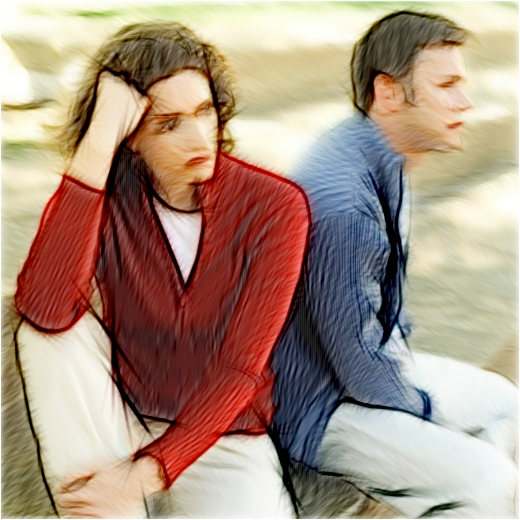



## SKETCH Picture   v1\.7

### Description

Sketch Pictures. Gabor Filter and Strokes. See Screenshot.

*** 1.7 -Minor Improvements

*** 1.6 -Reported by Robert Bug now Fixed

*** 1.5 -Load Settings from previous Rendered Picture (Works only with picture created since this version)

*** 1.0

-Faster Gabor Filtering

-SOBEL Edge detection

-BackGround:

Angles By HUE,

Angles By Edges Angles,

No Strokes: Blurred Source Pic.

-No Auto Save

-Save As

-Hidable/movable panel
 
### More Info
 

             |
---                |---
**Submitted On**   |2010-04-19 20:44:58
**By**             |[reexre](https://github.com/Planet-Source-Code/PSCIndex/blob/master/ByAuthor/reexre.md)
**Level**          |Intermediate
**User Rating**    |5.0 (130 globes from 26 users)
**Compatibility**  |VB 6\.0
**Category**       |[Graphics](https://github.com/Planet-Source-Code/PSCIndex/blob/master/ByCategory/graphics__1-46.md)
**World**          |[Visual Basic](https://github.com/Planet-Source-Code/PSCIndex/blob/master/ByWorld/visual-basic.md)
**Archive File**   |[SKETCH\_Pic2181815252010\.zip](https://github.com/Planet-Source-Code/reexre-sketch-picture-v1-7__1-73034/archive/master.zip)

